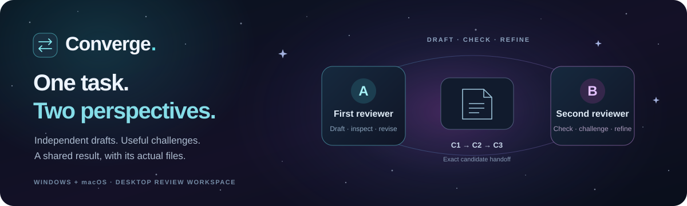
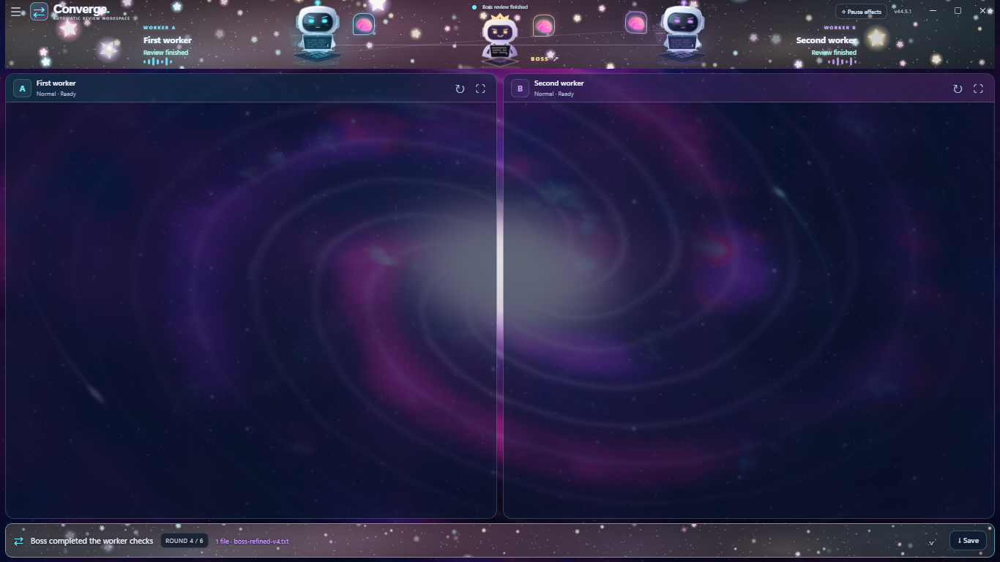
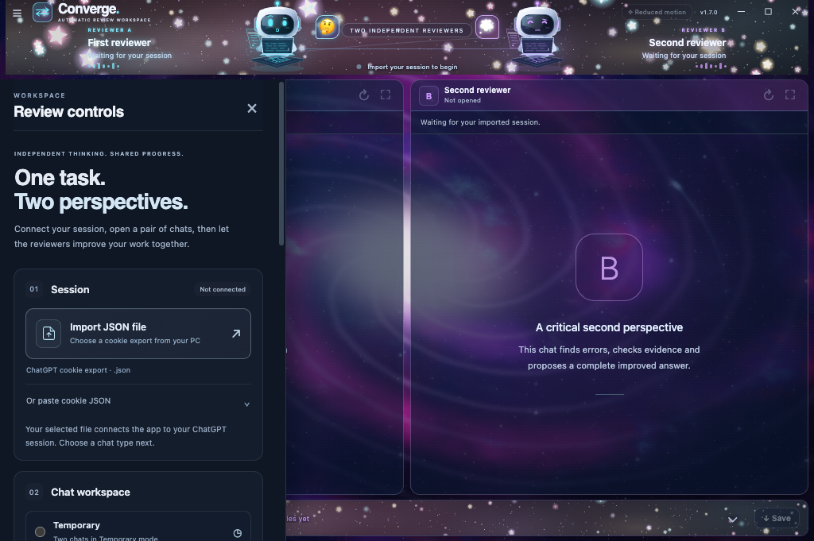
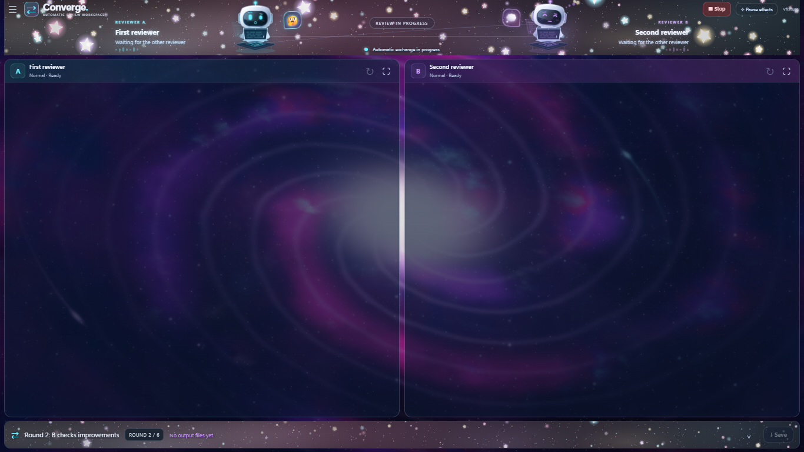
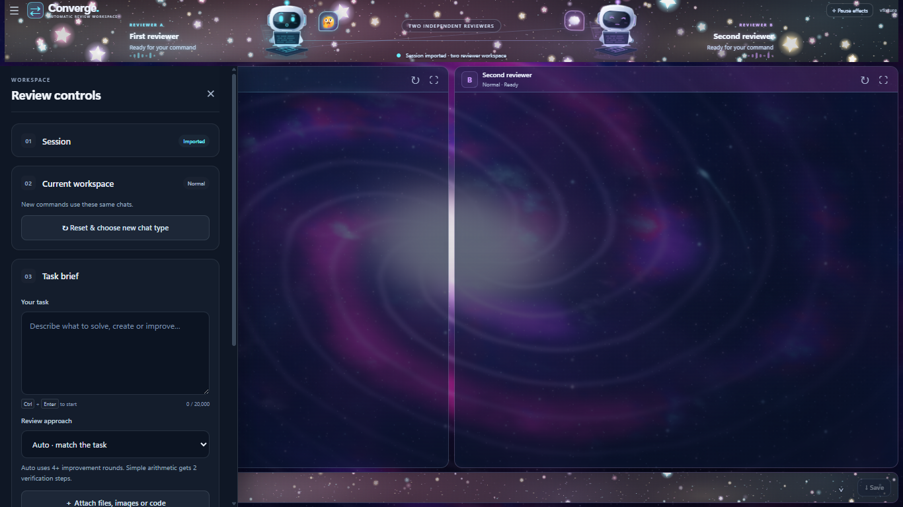

# Converge



A desktop workspace where a **boss chat directs two worker chats**: it plans their tasks, reviews their results, requests improvements and checks the final candidate. The two workers remain visible; click the middle boss character to open its sliding chat panel and guide the team.

**Current Windows development build: 1.8.0 x64 · Published Windows: 1.6.5 x64 · Published macOS: 1.7.0 ARM64**

Windows **1.8.0 has been built locally**. Its installer and portable executable are not yet published as a GitHub release. The download links below still point to the previous two-reviewer versions. The published Mac 1.7.0 app does not contain the new boss workflow.

[Boss workspace guide](docs/BOSS_WORKSPACE.md) · [Boss architecture](docs/BOSS_ARCHITECTURE.md) · [Windows 1.8 verification](docs/WINDOWS_1_8_VERIFICATION.md)



*New Windows 1.8 shell captured during controlled local verification. Embedded chat content is captured separately; this is not an authenticated conversation screenshot.*

[Windows release](https://github.com/EhosanurRahmanRomi/converge-desktop/releases/tag/v1.6.5) · [Mac release](https://github.com/EhosanurRahmanRomi/converge-desktop/releases/tag/v1.7.0) · [Mac guide](docs/MACOS_GUIDE.md) · [User guide](docs/USER_GUIDE.md) · [Developer guide](docs/DEVELOPER_GUIDE.md)

| Platform | Release | Downloads | Verification |
|---|---|---|---|
| Windows x64 | **1.8.0 · local build** | Installer and portable built locally; no public release link yet | [Current Windows verification](docs/WINDOWS_1_8_VERIFICATION.md) |
| Windows x64 | **1.6.5 · published** | [Installer](https://github.com/EhosanurRahmanRomi/converge-desktop/releases/download/v1.6.5/Converge-Setup-1.6.5-x64.exe) · [Portable](https://github.com/EhosanurRahmanRomi/converge-desktop/releases/download/v1.6.5/Converge-Portable-1.6.5-x64.exe) | [Recorded Windows evidence](docs/VERIFICATION.md) |
| macOS 13+, Apple Silicon, including MacBook Air M4 | **1.7.0** | [DMG](https://github.com/EhosanurRahmanRomi/converge-desktop/releases/download/v1.7.0/Converge-1.7.0-macOS-arm64.dmg) · [ZIP](https://github.com/EhosanurRahmanRomi/converge-desktop/releases/download/v1.7.0/Converge-1.7.0-macOS-arm64.zip) | [Recorded Mac evidence](docs/MACOS_VERIFICATION.md) |

The published Mac 1.7.0 build preserves the earlier two-reviewer workspace, animations and generated-file handoff. It adds Command shortcuts, native app/Edit menus, Mac file dialogs and Dock behavior. Its release gates passed on a native Apple Silicon Mac runner; the physical MacBook Air M4 and live authenticated Mac review have not been tested.



*Actual packaged Mac app on the native ARM64 runner with an empty session. The Reduced motion badge reflects that host's system preference.*



*Windows 1.6.5 interface preview using controlled fixture activity. These images show the shared layout; they are not Mac screenshots or screenshots of the authenticated verification run.*

## Windows 1.8 boss workspace

- **A boss and two workers.** Give the boss your task. It writes the substantive worker instructions, receives both workers’ replies and chooses the next useful checks or improvements. Each of the three pages uses the model you select in its own menu.
- **A sliding boss conversation.** Click the middle character to open the actual boss chat. Its instruction box starts a task, queues additional ideas during work and resumes the same task when the boss requests missing information.
- **Two visible workers.** The left/right worker workspace retains its tall chat layout. Closing the boss panel restores both workers; progress and output files remain in the bottom band.
- **Real file handoff.** Original source files go to the team. Generated files and images are captured and attached for further checks. Result identities and byte hashes bind final verification to the actual candidate files.
- **A checked finish.** Improvement tasks use at least four work cycles; fixed-answer verification uses a shorter route. The host requires both workers to verify the selected candidate before the boss approves completion. Missing output files or unresolved findings prevent agreement. Stop and run limits remain available.
- **Selectable appearance.** Night sky, Black horror and Alien world backgrounds apply to the actual chat pages. Robots, Curious explorers and Wonder spirits change the three characters. Stars, Ghost and Flowers decorate the upper and lower strips; animations can be turned off while work continues. Chat backgrounds stay still to reduce rendering work.
- **Reusable chats.** Start another task in the same team, or Reset to choose Temporary, Normal or Work mode for three fresh chats. Work mode depends on what the account exposes.

Converge uses an imported ChatGPT browser session. The current desktop flow does not require an API key. It uses its own in-memory session and does not modify or log out your Chrome profile.

## Start the Windows 1.8 team

1. Open the locally supplied Windows **1.8.0** installer or portable app. The currently published [Windows 1.6.5 release](https://github.com/EhosanurRahmanRomi/converge-desktop/releases/tag/v1.6.5) has the earlier two-reviewer flow. On an Apple Silicon Mac, use the [1.7.0 DMG](https://github.com/EhosanurRahmanRomi/converge-desktop/releases/download/v1.7.0/Converge-1.7.0-macOS-arm64.dmg) and follow its [Mac guide](docs/MACOS_GUIDE.md).
2. Open **Import JSON file** and choose your current ChatGPT cookie export. Import begins immediately; pasting JSON is an optional alternative.
3. Choose a chat type and press **Open the team**. Select the desired model in each worker page, then click the boss character to select its model.
4. Attach source files before starting. Give your task through **Instruction to the boss**, or use **Brief the boss** in the controls drawer. Send team instructions through these app controls; typing directly into an embedded page does not start the coordinated workflow.
5. Add instructions to the boss while the team works. Watch the progress band, inspect its review and limitations in the result drawer, and use **Save final files** when the checked result is accepted.

See the [boss workspace guide](docs/BOSS_WORKSPACE.md) for queuing, blocked tasks, appearance settings and file handling. The [Windows 1.8 verification record](docs/WINDOWS_1_8_VERIFICATION.md) documents this build’s own test scope; the historical results below belong to their stated versions.

The Windows executables are unsigned. Installation and portable-wrapper startup were not exercised in the recorded 1.6.5 verification; the actual unpacked built application was visibly launched and closed.

The Mac release uses an ad-hoc signature and has no Apple Developer ID signature or notarization. See the [Mac guide](docs/MACOS_GUIDE.md) for first-launch instructions and the [Mac verification record](docs/MACOS_VERIFICATION.md) for its own test scope.



*Windows 1.6.5 controls preview. The panel is opaque for readability and slides away when a review starts; this image does not show the 1.8 boss controls.*

## What was verified for macOS 1.7.0

| Check | Recorded result |
|---|---|
| Automated suite on the native Mac runner | **377 / 377 passed** |
| Controlled workflows from the packaged archive | **24 / 24 passed** |
| Actual packaged Mac app | **v1.7.0 startup, focused native window and app menu passed** |
| Native editing | **Select All, Copy and Paste passed in the shell and both embedded views** |
| Workspace Close and reopen | **Real Close disposed the views; automated activate opened a fresh setup window** |
| DMG and ZIP | **ARM64, ad-hoc signatures, source parity, permissions and framework links verified** |

The controlled workflow gate loads the packaged archive under a development Electron launcher with matching package metadata. The native startup gate separately launches **Converge.app's own executable**. Attach/Save fixture selections exercise real IPC and file bytes; physical file-picker interaction and live account review were not performed.

[Read the Mac evidence, artifact checksums and limits →](docs/MACOS_VERIFICATION.md)

## What was verified for Windows 1.6.5

| Check | Recorded result |
|---|---|
| Automated suite | **351 / 351 passed** |
| Packaged workflows with controlled local replies | **24 / 24 passed** |
| Source and packaged runtime parity | **18 runtime files plus metadata matched; 23 frozen inputs unchanged** |
| Actual Windows built-app startup | Visible **v1.6.5**, custom header and Close observed |
| Live GPT 5.6 High file review | **4 full rounds**, **2 actual candidate revisions**, both reviewers accepted **C3** |
| Generated Python file capture, relay and Save | Native downloads completed; saved bytes exactly matched accepted C3 |
| Independent audit of that saved file | **1,244 / 1,244 recorded checks passed** |

[Read the evidence and its limits →](docs/VERIFICATION.md)

Agreement is a review result, not a guarantee of correctness. The boss and workers can share a mistake. Repeated exchanges do not turn a model or reasoning setting into a stronger model, and important answers still need appropriate independent checks. The account's availability, upload rules and usage limits apply to every page; future ChatGPT page changes may require adapter updates.

## Explore the project

| Document | Contents |
|---|---|
| [Boss workspace guide](docs/BOSS_WORKSPACE.md) | Current Windows 1.8 team setup, boss instructions, queues, files and appearance |
| [Boss architecture](docs/BOSS_ARCHITECTURE.md) | Three-page orchestration, boss decisions, worker results and final-candidate checks |
| [Windows 1.8 verification](docs/WINDOWS_1_8_VERIFICATION.md) | Current build evidence, artifacts and testing limits |
| [Earlier user guide](docs/USER_GUIDE.md) | Published two-reviewer setup, modes, files, results and troubleshooting |
| [Mac guide](docs/MACOS_GUIDE.md) | Apple Silicon installation, Command shortcuts, Dock behavior and native file dialogs |
| [Mac verification](docs/MACOS_VERIFICATION.md) | Native build gates, package identities and Mac-specific evidence |
| [Developer guide](docs/DEVELOPER_GUIDE.md) | Local setup, tests, Windows and Apple Silicon Mac builds, and source map |
| [Architecture](docs/ARCHITECTURE.md) | Session boundaries, review lifecycle and file identity |
| [Verification](docs/VERIFICATION.md) | Recorded tests, live review, artifact hashes and scope |
| [Release notes](docs/RELEASE_NOTES.md) | macOS 1.7.0 and Windows 1.6.5 changes |
| [Artwork](docs/ARTWORK.md) | Current visual assets and provenance |
| [Historical documentation](docs/history/README.md) | Earlier development records, kept separate from current claims |

## Develop

```powershell
npm ci
npm test
npm run qa:boss
npm run qa:desktop
npm start
npm run build:win -- --publish never
```

The desktop runtime is Electron. **qa:boss** exercises the current three-chat workflow with controlled local pages; **qa:desktop** retains the earlier two-reviewer regression gate. The source also retains earlier extension/API experiments; these are not the current desktop connection path. See the [boss architecture](docs/BOSS_ARCHITECTURE.md) and [developer guide](docs/DEVELOPER_GUIDE.md) before changing the browser bridge or coordinator.

The published Mac 1.7.0 DMG and ZIP were built and verified on Apple Silicon. Building a new Mac package from the current boss source requires its own native verification; the historical Mac evidence does not certify the 1.8 workflow. See the [Mac build instructions](docs/DEVELOPER_GUIDE.md#build-apple-silicon-mac-artifacts).

## Session privacy and project status

Treat cookie exports as account credentials. Never upload them to this repository, attach them to an issue, or paste them into a model conversation. The app reads the file you select, displays only its filename, clears the import input, and keeps its imported session in memory. Closing the app loses its session and exchange state. Generated files are saved only when you choose to save them; provider-side storage depends on the selected ChatGPT mode.

On Mac, closing the window clears that workspace and its imported session. The app remains available in the Dock; opening it again creates a fresh setup window. Use **Command + Q** to quit, or minimize to keep the current review running.

Converge is an independent project and is not an official OpenAI or ChatGPT application. Its own source remains **UNLICENSED**, as declared in `package.json`; public visibility does not grant reuse rights. Third-party notices are in [THIRD_PARTY_NOTICES.md](THIRD_PARTY_NOTICES.md).
