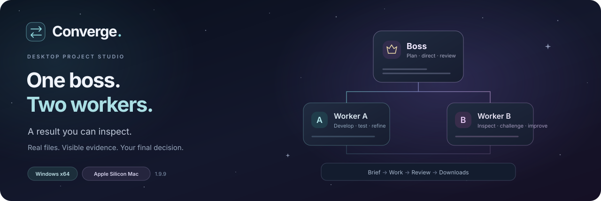
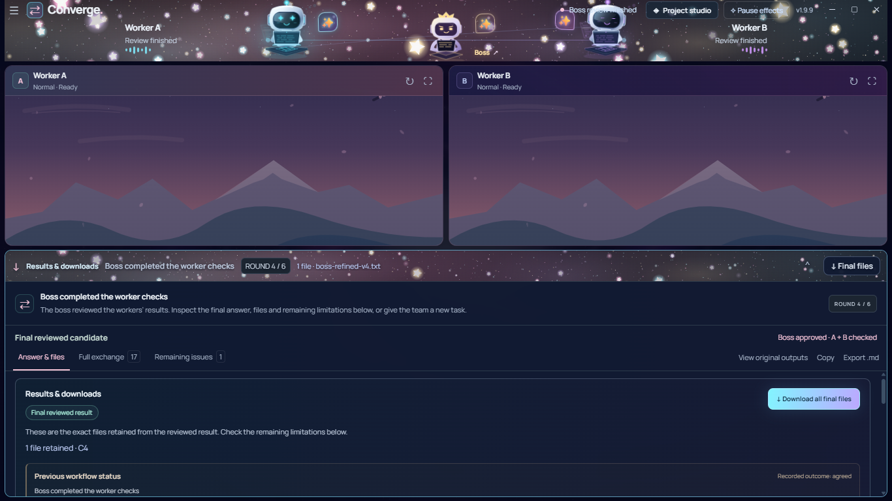
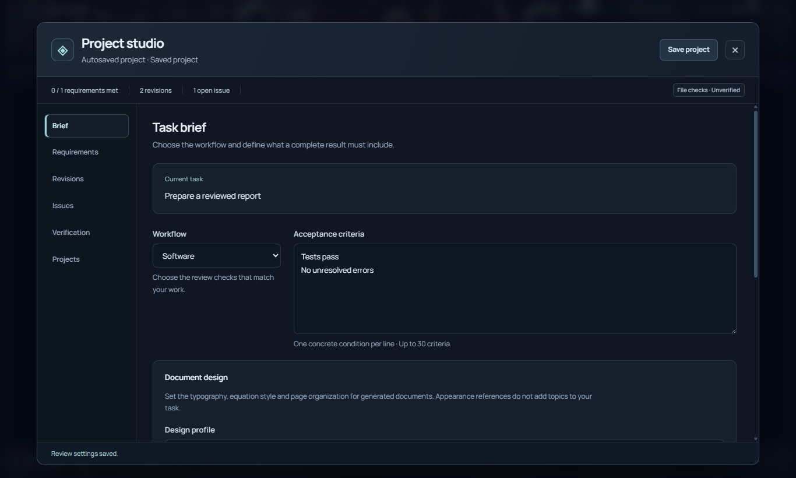

# Converge

**A desktop project studio for work that needs a second look.**

Give one boss chat a task. It directs two workers, compares their answers and files, requests useful revisions, and checks the selected result. Keep the workers visible, open the boss panel when you need it, and follow the evidence through to download.

[Download 1.9.9](https://github.com/EhosanurRahmanRomi/converge-desktop/releases/tag/v1.9.9) · [User guide](docs/USER_GUIDE.md) · [Project studio](docs/STUDIO_GUIDE.md) · [Mac setup](docs/MACOS_GUIDE.md) · [Developer guide](docs/DEVELOPER_GUIDE.md)

## Download

| Platform | Install | Other option |
|---|---|---|
| **Windows x64** | [Converge Setup 1.9.9](https://github.com/EhosanurRahmanRomi/converge-desktop/releases/download/v1.9.9/Converge-Setup-1.9.9-x64.exe) | [Portable EXE](https://github.com/EhosanurRahmanRomi/converge-desktop/releases/download/v1.9.9/Converge-Portable-1.9.9-x64.exe) |
| **Apple Silicon Mac · macOS 13+** | [ARM64 DMG](https://github.com/EhosanurRahmanRomi/converge-desktop/releases/download/v1.9.9/Converge-1.9.9-macOS-arm64.dmg) | [ARM64 ZIP](https://github.com/EhosanurRahmanRomi/converge-desktop/releases/download/v1.9.9/Converge-1.9.9-macOS-arm64.zip) |

The Mac build targets Apple Silicon, including MacBook Air M4. Both platforms bundle their desktop runtime; end users do not need Node.js or Electron. Windows artifacts are unsigned. Mac artifacts use an ad-hoc signature and are not notarized; see the [Mac first-launch guide](docs/MACOS_GUIDE.md#if-macos-blocks-the-first-launch).

Use the [release page](https://github.com/EhosanurRahmanRomi/converge-desktop/releases/tag/v1.9.9) for checksums and verification attachments. Earlier versions and their original evidence remain in [release history](https://github.com/EhosanurRahmanRomi/converge-desktop/releases).

[Offline manuals ZIP](https://github.com/EhosanurRahmanRomi/converge-desktop/releases/download/v1.9.9/Converge-1.9.9-Manuals.zip) · [Full source ZIP](https://github.com/EhosanurRahmanRomi/converge-desktop/releases/download/v1.9.9/Converge-1.9.9-Source.zip) · [SHA-256 checksums](https://github.com/EhosanurRahmanRomi/converge-desktop/releases/download/v1.9.9/SHA256SUMS.txt) · [Release verification](https://github.com/EhosanurRahmanRomi/converge-desktop/releases/download/v1.9.9/Converge-1.9.9-Verification.json)

## The workspace

| Capability | What you can do |
|---|---|
| **Boss + two workers** | Send one task, queue follow-up ideas, watch independent work and inspect the boss's next plan |
| **Project studio** | Keep the brief, acceptance checklist, revisions, findings, verification and saved projects together |
| **Document design** | Choose academic, reference, editorial or neutral presentation; attach appearance examples separately from content |
| **File handoffs** | Send original inputs to the whole team and pass captured generated files onward with their exact identities |
| **Results & downloads** | Download one file, the current bundle or another completed draft during work and after recovery |
| **Interruption recovery** | Observe owned requests, retain completed work and request focused repairs for supported interruptions |
| **Local evidence** | Inspect actual byte, syntax, format and bounded PDF/image checks separately from model review |
| **Your controls** | Stop the exchange, cancel an upload, continue a blocked task or reset to a fresh team |
| **Selectable atmosphere** | Choose still chat backgrounds, three character crews, Stars/Ghost/Flowers, full motion, low power or Off |

### A visible team, with room to work

*Actual 1.9.9 renderer captured during controlled local verification. The pages and result are test fixtures; this is not an authenticated account or a model-quality demonstration.*

Click the middle character to open **Boss chat**. Use **Instruction to the boss** for coordinated instructions. The native ChatGPT composer is a direct conversation and does not dispatch worker tasks.

Improvement tasks use at least four work cycles. Recognized fixed-answer tasks can use two verification steps. The host requires checks of the same selected candidate before completion; unavailable tools, missing required files and unresolved requirements remain visible. More rounds do not guarantee a better or correct answer.

## Start a task

1. Open Converge and choose **Import JSON file** for your own current ChatGPT session export.
2. Choose **Temporary**, **Normal** or **Work mode**, then **Open the team**. Availability depends on the account.
3. Select a model independently in the boss and both worker pages.
4. Attach content files. For documents, use **Add a design reference** for appearance examples and set **Project studio → Brief → Document design**.
5. State the required output, scope and acceptance conditions through **Instruction to the boss** or **Brief the boss**.
6. Watch the progress band. Open **Results & downloads** for files, the answer, review history and remaining issues.
7. Save the project or export a delivery package. **Stop** stays available during work.

The [user guide](docs/USER_GUIDE.md) covers uploads, long tasks, drafts, recovery, settings and troubleshooting.

## A project, not just a transcript

*Controlled renderer fixture with generic sample data. No private source documents, account details or session credentials are included.*

The studio has six sections: **Brief · Requirements · Revisions · Issues · Verification · Projects**.

- **Brief:** choose a task preset and define inspectable acceptance conditions.
- **Requirements:** see which conditions are met, failed or unverified, with the recorded evidence.
- **Revisions:** compare written answers, inspect file hashes, preview files and return to an earlier candidate.
- **Issues:** track a finding through assignment, a fix and a recheck.
- **Verification:** separate executed local checks from model and manual assessments.
- **Projects:** recover saved work, download past outputs and export task or delivery archives.

Document design defaults to **Academic math notes**. **Match attached reference** sends the actual reference files to the team and asks for a rendered-page style comparison. Appearance references do not add topics to the task. The [document quality guide](docs/DOCUMENT_QUALITY.md) explains the layout and content gates.

### Practical limits

| Area | Application limit |
|---|---|
| Original inputs, including design references | **5 files total**, **512 MiB each**, **1 GiB combined** |
| Image/spreadsheet input guards | **20 MiB images**, **50 MiB spreadsheets** |
| Review controls | Up to **12 cycles**, a baseline **2 hours per response**, **24 hours per workflow** |
| Local project storage | Up to **3 GiB of distinct retained file bytes**, **48 candidate revisions** |
| Local text/image content checks | **16 MiB** per supported file; images also have a **50 megapixel** bound |
| Local PDF checks | **64 MiB**, **1–1,000 pages**; rendering coverage is reported separately |

Large input files use bounded local reads and transfers. Service processing, accepted formats, token limits and account quotas still apply. A 512 MiB local upload test does not establish ChatGPT acceptance. A large file can receive a verified hash while its content check remains unverified.

## Evidence and verification

[Windows 1.9.9 verification](docs/WINDOWS_1_9_9_VERIFICATION.md) records source tests, packaged workflow checks, file parity and actual portable startup/Close, with the tested artifact identity.

**Mac 1.9.9:** native ARM64 packaging and verification are being completed for this release. The release's Mac verification attachment is authoritative once available; older Mac runs are historical evidence, not proof of 1.9.9. A physical MacBook Air M4 and a live authenticated Mac task have not been tested.

Local workflow tests use controlled provider replies. They check coordination, transfers, recovery and controls. They do not measure general answer quality or establish an authenticated 1.9.9 model run.

Local verification establishes only the properties named in its report. PDF rasterization does not establish aesthetics or factual accuracy. A model's account of visually inspecting every page remains **Model review**. Optional generated-program tests require Docker and fixed local images; unavailable tooling is reported instead of counted as a pass.

**Agreement is a review result. It is not a guarantee of correctness.**

## Session and data

Converge currently uses an imported ChatGPT web session in its own in-memory browser profile. It does not modify or sign out Chrome. The desktop flow does not require an API key; models and features depend on the account. This is an independent project, not an official OpenAI application.

Session exports are credentials. Import them through setup, keep them private, and never include them in Git, screenshots or issue reports. Closing the workspace clears the imported session. Local project checkpoints retain task inputs and outputs for recovery, but exclude browser authentication and live request state. Inspect project and delivery archives before sharing.

The browser adapter depends on the provider's visible interface; changes to that interface can require an update. See [session options](docs/AUTH_OPTIONS.md) and [recovery behavior](docs/MODEL_ERROR_RECOVERY.md).

## Source, manuals and feedback

| Resource | Purpose |
|---|---|
| [User guide](docs/USER_GUIDE.md) | Installation, team setup, files, results and troubleshooting |
| [Studio guide](docs/STUDIO_GUIDE.md) | Acceptance, document design, revisions, evidence and project recovery |
| [Mac guide](docs/MACOS_GUIDE.md) | Apple Silicon installation, first launch and native shortcuts |
| [Boss workflow](docs/BOSS_WORKSPACE.md) | Request ownership, cycles, final checks and continued work |
| [Document quality](docs/DOCUMENT_QUALITY.md) | Content, mathematical typography and rendered-page review |
| [Developer guide](docs/DEVELOPER_GUIDE.md) | Source layout, development, tests and packaging |
| [Architecture](docs/BOSS_ARCHITECTURE.md) | Boss coordination and platform boundaries |
| [Release notes](docs/RELEASE_NOTES.md) | Version history and recorded changes |
| [Third-party notices](THIRD_PARTY_NOTICES.md) | Runtime, font and bundled dependency notices |

For a [bug report](https://github.com/EhosanurRahmanRomi/converge-desktop/issues), include the app version, OS, mode, safe steps, expected behavior and observed failure. Redact account details and private task content. Never attach cookies or tokens.

Built by [Ehosanur Rahman Romi](https://github.com/EhosanurRahmanRomi).
