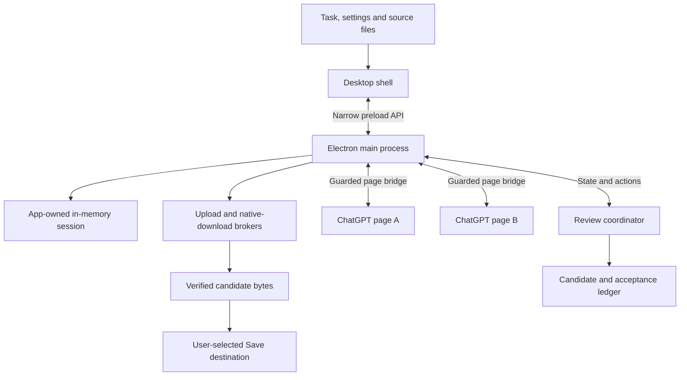
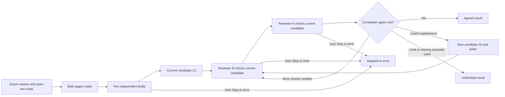

# Architecture

For the current three-chat application, read the [boss architecture](BOSS_ARCHITECTURE.md). This document describes the retained earlier two-reviewer transport design.

[← Project](../README.md) · [Developer guide](DEVELOPER_GUIDE.md)

Converge separates the desktop shell, native host, shared review coordinator and visible provider pages. The app has its own browser session; it does not automate or modify a user's Chrome profile.

## Runtime components

The shell's content security policy loads local scripts/styles and does not provide arbitrary network access to its renderer. Main-process checks guard actions; the preload exposes a narrow interface. Embedded pages still communicate with ChatGPT for their normal service functions.

The native host creates the frameless window and custom Minimize/Maximize/Close behavior. The renderer owns the task drawer, progress band, findings and candidate trail. Page views occupy the two large chat regions.

`src/platform/desktop-lifecycle.js` owns the platform integration. On Mac it installs native editing menus, keeps the application available after its window closes, and serializes Dock activation and second-instance requests. Closing disposes the workspace's views, coordinator, download jobs and IPC handlers and clears that workspace's isolated session. Reopening creates a fresh workspace. On Windows the app still quits after its last window closes. The shared renderer, review coordinator and file brokers remain the same implementation on both platforms.

## Review lifecycle

A full round contains a fresh check by each reviewer. Improve/general Auto tasks require at least four rounds. Verify and recognized simple arithmetic use one full round, corresponding to two verification steps. Draft generation is counted separately.

The coordinator tracks the current candidate, revisions, reviewer acceptances, unresolved findings and requested deliverables. Acceptance of an old candidate is not acceptance of its replacement. File-dependent tasks also need the actual supported output, not only a textual statement that it exists.

Round, reply-time, run-time and progress limits make the exchange bounded. Cancellation propagates through pending work. Stop leaves the current result available to inspect/save rather than claiming it finished.

## Source and candidate identity

| Object | Meaning |
|---|---|
| Original source | The files supplied by the user for this task |
| Independent draft | One reviewer's first answer before seeing the peer's answer |
| Current candidate | The answer and actual output files being reviewed now |
| Revision | A meaningful changed answer/file candidate with a new identity |
| Acceptance | A reviewer's check of the exact current candidate |

The original task, source constraints and required work remain authoritative across revisions. For readable code, bounded complete text readbacks accompany identity checks. Large requests that cannot carry their complete required contents stop with a limit message. They are not silently truncated.

Readable source code may use a `.txt` upload alias. The original filename, candidate ID and SHA-256 are supplied so the alias does not become a different deliverable. PDF/image/non-text originals that require access are attached again as needed.

## File handoff

1. The page bridge identifies a supported displayed image or visible downloadable output belonging to the current response.
2. The native broker authorizes the owned request and expected filename/type/size.
3. Captured bytes undergo format/readability checks and receive a digest.
4. Those actual bytes are attached to the peer review with their candidate identity.
5. Native Save exports the verified candidate bytes to the chosen destination.

The broker rejects stale or mismatched output identities, unsupported files and HTML masquerading as an output. A narrow `.py`/`text/x-python` compatibility rule handles native Python downloads without weakening unrelated checks. ZIP packages remain opaque and are not executed or extracted.

A renamed file with unchanged verified contents is not a byte revision. An expired or inaccessible output produces a bounded error. If a required file is missing, a bounded creation request precedes an unfinished/error result.

## Session boundary

The user selects a cookie export; the host validates/imports it into an app-owned memory session. The shell clears the import field and shows a filename/status, not cookie values. Invalid replacement imports preserve the accepted current session. Closing the app loses its imported session and exchange state.

Provider-side chat retention is separate from local memory. Normal and Work pages can still retain conversations according to ChatGPT's behavior. The app does not claim to delete those conversations or bypass account verification.

## Required evidence and its limits

Native compilation/backtesting requests add completion requirements to the run. Candidate-specific digests, attached reports/logs and structured reported evidence help prevent replacing required work with agreement about its absence.

These gates check file identity and model-reported evidence structure. They do **not** independently authenticate an MT5 run, establish trading profitability or certify all generated code. Important results need an independent appropriate test of the exported artifact.

## Decoration boundary

The central galaxy/chat backdrops remain still. Cached sprite movement lives in the upper reviewer and lower progress strips; bots retain CSS/SVG workstation movement and file-handoff decoration. The renderer caps Stars/Flowers at 30 fps and Ghost at 24 fps, with pause/disposal for hidden state and reduced motion.

Appearance preference changes are independent from review actions. Turning animation off does not cancel either reviewer. Bot emotions are decorative, while the text activity labels follow app state.
