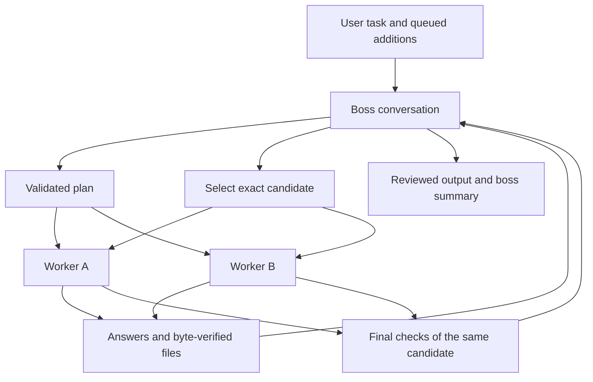

# Boss workspace internals

## Routing and ownership

The main process owns `left`, `right` and `boss` WebContentsViews. Each uses a sandboxed preload, context isolation and the app's temporary session. The shell alone can open the workspace, send a task, queue a boss instruction or choose an appearance. Page events are authenticated against their own main frame and exact permitted origin; a worker cannot impersonate the boss or a human instruction.

Every submitted task has a run ID and unique request ID. Stale replies, abandoned generations and outputs arriving after Stop or Reset cannot advance the current run. Page transport executes outside the serialized state queue so waiting for a model or file download does not hold Stop.

## Planning protocol

Boss replies use a bounded JSON object with the current `request_id`. Normal actions are `dispatch`, `verify`, `finish` and `blocked`. A recovery request additionally permits `repair` for its one named failed worker; the host rejects dispatching both workers or changing sides during that recovery. Worker assignments contain the boss's task-specific instructions. Invalid plans receive bounded repair opportunities; repeated invalid controls retain evidence and report what needs attention.

Both workers return ordinary work responses during improvement cycles. Final verification uses a small schema bound to the candidate ID and its SHA-256 identity. Final acceptance requires concrete checks, no unresolved issues, the same candidate on both workers, the current user instruction revision, and required deliverables/evidence.

User additions increment an instruction revision and enter a bounded queue. A plan already being generated cannot dispatch under superseded instructions. The boss replans at the next safe boundary. Updated instructions invalidate prior final acceptance.

## Long-running requests and recovery in 1.9.7

The regular supervision interval is five minutes. An exact owned page failure wakes an immediate proof check; an interrupted stream with active native generation and a nonterminal reconnection use 30-second checks. Confirmed idle failures enter a per-worker recovery queue immediately, including while a healthy peer is generating. The boss receives the original assigned scope, actual retained evidence, failure receipt and live healthy-request summary. Only the failed worker receives its new focused continuation. Multiple failed jobs are planned in sequence and recovery of the boss's recovery request is bounded too.

The two-hour response budget measures observation. Its expiry extends observation in bounded intervals within the 24-hour workflow cap and triggers a progress check. Healthy native generation is not cancelled because of that local timer. A main-frame reload or lost acknowledgement uses `RESUME_OBSERVATION` with the original full prompt and expected conversation: no Send, Stop or file upload. The page must prove one exact newest tracked user turn before resuming. Wrong-chat, ambiguous history, later human instructions and cancelled requests cannot be adopted.

Actual completed pair results remain separate from interruption diagnostics. A resumed work pair counts once only after both original healthy and resumed failed sides deliver real results. Invalid output identity is quarantined before becoming candidate evidence; the healthy side can finish and retain its files. Recovery attempts are bounded, user Stop remains immediate, and unavailable ownership/access reports a concrete attention condition. See [model error recovery](MODEL_ERROR_RECOVERY.md).

## Historical 1.8.2 deadlines and transport

Production defaults are **two hours per model request**, **24 hours per workflow** and a **five-minute worker inspection interval**. The model deadline is refreshed after attachment preparation, so upload/download time is not charged against the response allowance. The workflow deadline remains a wall-clock cap. Round limits and user Stop are independent of both deadlines.

`INSPECT_PROGRESS` is bound to the exact pending run/request and returns a compact state summary. Active generation stays active; silence or inspection failure does not imply interruption. Safe recovery requires an explicit provider interruption for the owned request, no active generation, and no newer human message. The app retains completed outputs and an interruption report, invalidates the interrupted worker's acceptance and waits for a safe planning boundary. The boss plans fresh work; the other worker is not stopped and an incomplete cycle is not counted as complete.

Time expiry cancels pending requests and retains completed results as `limit_reached`. An explicit boss instruction from `blocked` or `limit_reached` continues the same task, restores a fresh workflow deadline and invalidates prior final verification. A clock-paused run must first acknowledge `RESUME_RUN` on all three owned pages. New requests use fresh identities; a cancelled unfinished request is never silently replayed or treated as finished. A new task after Stop or agreement is separate.

The result drawer distinguishes a current candidate from a final reviewed candidate and exposes unresolved issues, the boss's reported checks/limitations, transcript and bounded monitoring history. Remaining issues also includes the workflow error and current final-verification worker findings. Markdown export uses the same unresolved-issue collection and includes monitoring/status, preserving an unfinished result's context. These records describe the workflow; they do not establish that external tests were executed or that the result is correct.

## Files

Source bytes stay private to the coordinator. Original files, worker results and selected candidate uploads have separate transport labels. Canonical output names and bytes are retained for saving. Text source is transferred as inert text where needed; it is never executed by the application.

The page bridge captures supported visible output actions. The main process validates descriptors, format, size, canonical base64 and SHA-256 before relaying files. Save checks the same identity again and uses native dialogs. A changed or reordered file is rejected rather than silently substituted.

The 1.8.2 application validates **128 MiB per file** and **256 MiB per transfer batch**. Source selection is limited to five files. Originals and the latest worker bundles may total more than one native upload: internal transfers stage up to 15 distinct names in batches of five, verifying every receipt before one prompt submission. The provider's own limits can be lower.

Large uploads use bounded, ordered IPC chunks and a single validated commit, rather than one large Electron message. Page exports and native download reads use bounded chunks too. Ownership, cancellation, complete length, canonical encoding and file hashes remain checked at their relevant boundaries. Chunk staging does not retry a prompt or bypass provider validation.

Stop aborts pending batches. Provider upload rejection stops visibly; no missing file is replaced with its filename or a prose description. For an incomplete source selection, `RECHECK_ATTACHMENTS` checks tracked receipts without reuploading retained source bytes. Only confirmation on all three pages releases those sources for Start. Attribute-only upload completion also refreshes page readiness. Large text originals omitted from bounded readable snapshots are refreshed using their complete bytes.

File allowances are separate: upload preview **10 minutes**, host upload acknowledgement **12 minutes**, native download **five minutes per file**, page export **six minutes per file**, and host export acknowledgement **35 minutes** for a collection. They remain finite and report failure explicitly. Provider acceptance, account access and download availability are external dependencies.

If a final checker produces a changed file alongside malformed control JSON, a formatting retry retains that verified replacement. It cannot erase the changed-file evidence and accept the older candidate. Both worker calls are prepared before registering either, so a transport-budget error on the second assignment cannot leave the first falsely pending.

## Rendering

The worker views fill the main workspace. The boss view is hidden until its drawer opens. Native bounds are clipped so worker pages cannot cover the boss drawer, controls or output drawer. Background choices are applied inside each page by a cosmetic preload module. Chat backgrounds are still; narrow decorative ribbons and character transforms carry motion. Pause, hidden-window and reduced-motion policies suspend decorative work while transport remains responsive.
