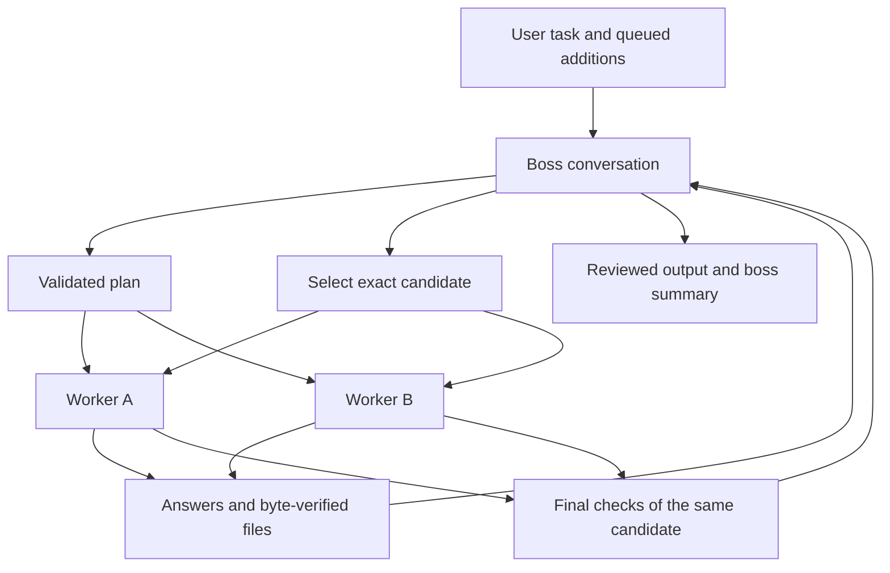

# Boss workspace internals

## Routing and ownership

The main process owns `left`, `right` and `boss` WebContentsViews. Each uses a sandboxed preload, context isolation and the app's temporary session. The shell alone can open the workspace, send a task, queue a boss instruction or choose an appearance. Page events are authenticated against their own main frame and exact permitted origin; a worker cannot impersonate the boss or a human instruction.

Every submitted task has a run ID and unique request ID. Stale replies, abandoned generations and outputs arriving after Stop or Reset cannot advance the current run. Page transport executes outside the serialized state queue so waiting for a model or file download does not hold Stop.

## Planning protocol

Boss replies use a bounded JSON object with the current `request_id`. Supported actions are `dispatch`, `verify`, `finish` and `blocked`. Worker assignments contain the boss's task-specific instructions. The application supplies routing and evidence requirements, not a fixed task plan. Invalid plans receive bounded repair opportunities; repeated invalid controls stop with a visible error.

Both workers return ordinary work responses during improvement cycles. Final verification uses a small schema bound to the candidate ID and its SHA-256 identity. Final acceptance requires concrete checks, no unresolved issues, the same candidate on both workers, the current user instruction revision, and required deliverables/evidence.

User additions increment an instruction revision and enter a bounded queue. A plan already being generated cannot dispatch under superseded instructions. The boss replans at the next safe boundary. Updated instructions invalidate prior final acceptance.

## Files

Source bytes stay private to the coordinator. Original files, worker results and selected candidate uploads have separate transport labels. Canonical output names and bytes are retained for saving. Text source is transferred as inert text where needed; it is never executed by the application.

The page bridge captures supported visible output actions. The main process validates descriptors, format, size, canonical base64 and SHA-256 before relaying files. Save checks the same identity again and uses native dialogs. A changed or reordered file is rejected rather than silently substituted.

## Rendering

The worker views fill the main workspace. The boss view is hidden until its drawer opens. Native bounds are clipped so worker pages cannot cover the boss drawer, controls or output drawer. Background choices are applied inside each page by a cosmetic preload module. Chat backgrounds are still; narrow decorative ribbons and character transforms carry motion. Pause, hidden-window and reduced-motion policies suspend decorative work while transport remains responsive.
