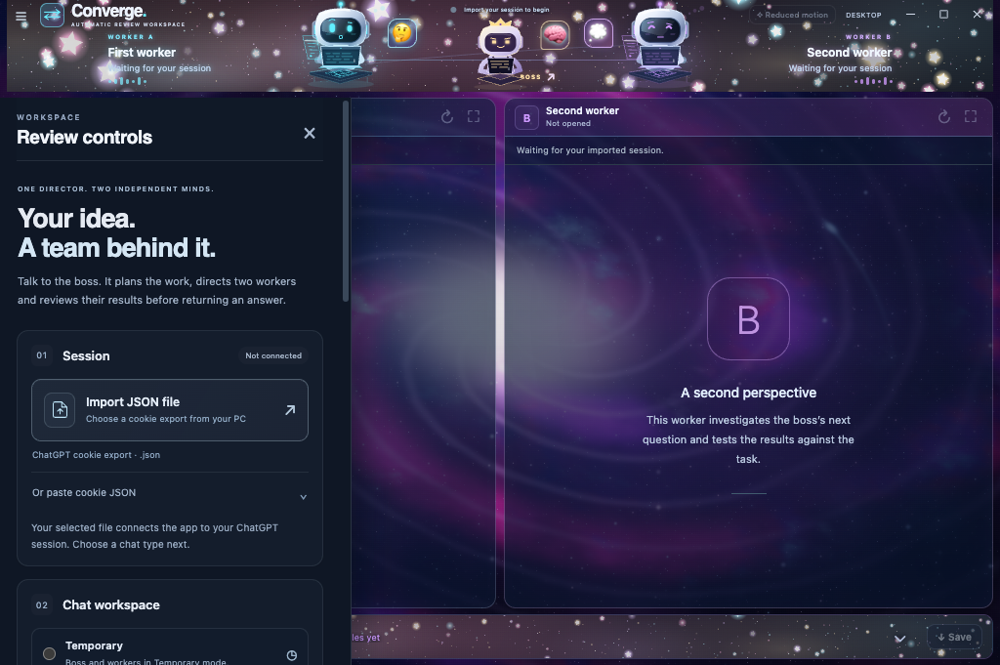

# Mac 1.8.1 verification

[← Project](../README.md) · [Mac installation](MACOS_GUIDE.md) · [Windows verification](WINDOWS_1_8_1_VERIFICATION.md) · [Machine-readable evidence](evidence/macos-1.8.1.json)

**5 October 2026 · Native Apple Silicon ARM64 · macOS 15.7.9**

The full boss-and-two-workers application was built and verified on a native GitHub Mac runner. It contains the same runtime source bytes as the final Windows 1.8.1 build.

## Recorded checks

| Check | Result |
|---|---|
| Complete source suite | **425 / 425 passed**, zero failed or skipped; sequential native run |
| Packaged boss workflows | **16 / 16 passed**, complete screenshot captures |
| Preserved file-format and transport workflows | **24 / 24 passed** |
| Actual packaged executable | **1.8.1**, native key window, Command hint, menu and boss drawer verified |
| Native Select All, Copy and Paste | **Five surfaces**: shell, worker A, worker B, boss page and boss instruction box |
| Close and fresh activation | Workspace disposed, all three views destroyed, fresh session on automated activate |
| Bundle and release archives | **13 ARM64 binaries**, **14 framework links**, permissions and ad-hoc signatures verified |
| Source/package parity | **21 runtime files** and package metadata matched |
| Extracted ZIP and read-only mounted DMG | Same source bytes and signatures, preserved links/permissions, Applications shortcut checked |
| Downloaded artifacts | Rehashed on the publication host; sizes and SHA-256 matched native report |

The boss fixture exercises three separate pages, mixed text/PDF/PNG uploads, boss assignments and queued additions, four work cycles, exact candidate review, Save bytes, same-chat follow-ups, Stop, Reset, Normal/Temporary/Work choices, five backgrounds and three character styles. Provider replies and dialog selections are controlled offline fixtures. They do not establish account-specific Work availability or a live Mac model run.

## Provenance

- [Successful native workflow — 37348451621](https://github.com/EhosanurRahmanRomi/converge-desktop/actions/runs/37348451621)
- Tested source: [3e14490](https://github.com/EhosanurRahmanRomi/converge-desktop/commit/3e1449046fc1b86a1a3f2960e6b94e61027f05cf)
- Packaged archive SHA-256: `b5db09b9307d21a7ce891583914d0f65328fe69687d2356dcf0a9b7a109354ee`
- Full source suite took **114.344 seconds**.

The final release adds documentation and inspected screenshots to this tested source. All packaged runtime hashes remain unchanged. An earlier run exposed a drawer-animation settlement race in the UI test; the corrected test waits for fonts, stable layout and exact bounds without relaxing its assertions. The full native rerun passed.

## Native startup image

This is the actual packaged app with an empty isolated session. It captures initial paint, where the version label still says DESKTOP; the native report separately verifies the settled **v1.8.1** and controls. Reduced motion reflects the runner's preference. It is not a physical M4 or authenticated conversation image.

## Artifacts

| File | Bytes | SHA-256 |
|---|---:|---|
| `Converge-1.8.1-macOS-arm64.zip` | 132,246,619 | `d4f14533308bcab8c66ce69b703dc2a0ece17be052e06d1d32a32bead8d8c058` |
| `Converge-1.8.1-macOS-arm64.dmg` | 132,968,917 | `421dd32dbb8532d34071fa7d06fef1f5d91218c61d3cb6e1a038dd759c0f6909` |

## Scope and remaining limits

The native startup launches Converge.app's own executable. Editing checks use blank local views and the actual boss instruction field; the boss drawer is opened and its real slot geometry measured. The packaged workflow gate separately verifies normal coordinator-driven view bounds. Close uses the actual shell control; reopen emits the Electron activate event.

The Mac build uses an **ad-hoc signature** without Developer ID signing or Apple notarization. Follow the [Mac installation guide](MACOS_GUIDE.md) for first launch. Fresh Finder installation, quarantined first launch, physical MacBook Air M4 behavior and live authenticated Mac file exchange have not been tested. No GPU, battery or thermal benchmark was performed.

Offline fixture pages emit Electron CSP warnings and the host reports sandbox XPC notices; those logs are retained privately. They did not fail the native gates. Screenshot completeness is asserted separately. Model agreement does not guarantee correctness; important generated results need their own independent checks.
