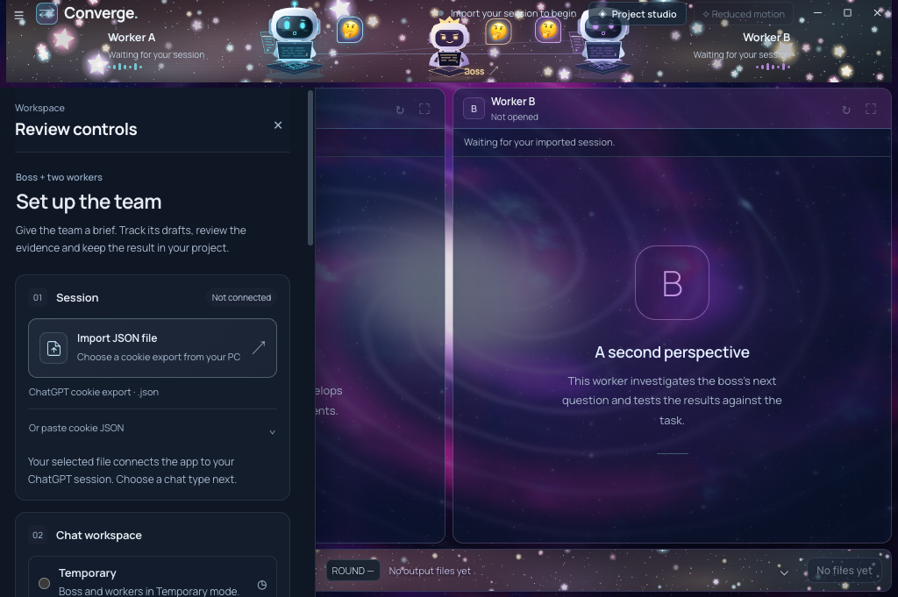

# Mac 1.9.9 verification

[Release verification](VERIFICATION.md) · [Mac installation](MACOS_GUIDE.md) · [Project studio](STUDIO_GUIDE.md)

Native Apple Silicon verification passed **671 source tests, 25 packaged transport checks, 22 packaged boss checks and 17 packaged studio checks**, plus actual startup, native editing, Close/reopen and ZIP/DMG bundle verification.

## Build identity

- Version: **1.9.9**; architecture: **ARM64**; minimum macOS: **13**.
- Source build commit: `c43f95db6628f40b67d01340fb7bd3cd783c1bd0`.
- Native workflow: [37608181127](https://github.com/EhosanurRahmanRomi/converge-desktop/actions/runs/37608181127).
- Host: native Apple Silicon GitHub runner, macOS **15.7.9**.
- All **41** production source files match the Windows installer and approved portable.

## Completed gates

| Gate | Result |
| --- | --- |
| Full sequential source suite | 671/671 passed |
| Packaged transport regression | 25 checks passed |
| Packaged boss and two workers | 22 checks passed |
| Packaged studio, downloads, recovery and document design | 17 checks passed |
| Actual packaged startup | Passed |
| Native editing in shell, boss and both worker pages | Passed |
| Close cleanup and activation reopen | Passed through an automated Electron activation event |
| ZIP extraction and read-only DMG mounting | Both shipped bundles passed |
| ARM64 runtime/native PDF dependencies | Passed |
| Source parity, permissions, framework links and strict ad-hoc signatures | Passed |
| Clean source tree after gates | Passed |

The packaged checks use local replies and synthetic files. The current boss/studio gates exercise the production coordinator. The preserved transport regression uses an explicit legacy coordinator fixture; its download proof covers the owned-page export bridge and byte validation. Current production download controls are covered separately by the studio gate. Reopen was triggered through Electron's activation event; physical Dock input was not tested.

*The actual packaged Mac app at startup, with an empty isolated session. No account or private task is shown.*

## Downloads

### Converge-1.9.9-macOS-arm64.zip

- Bytes: **153406761**.
- SHA-256: `64fffa49276890c3a7b273110c8e30b43c1cb8907fd57fc78b7b27e2b41e784f`.

### Converge-1.9.9-macOS-arm64.dmg

- Bytes: **154092937**.
- SHA-256: `b59efa943a34506115f8f3069e933567d190687478f86cc09a787074d0d4bc13`.

The [machine-readable build evidence](evidence/macos-1.9.9.json) and release attachments retain archive/signature details, source hashes, workflow provenance and exact artifact identities. The combined release verification report additionally records source-test and packaged-test counts.

## Scope

The build uses an ad-hoc signature. It is not Developer ID signed or Apple notarized. See [first-launch instructions](MACOS_GUIDE.md#if-macos-blocks-the-first-launch).

No physical MacBook Air M4 or fresh authenticated Mac model task was tested. These gates establish packaging and the named controls/fixtures; they do not guarantee model accuracy, aesthetics, provider availability or file acceptance. Generated-program execution is not established by the local fixtures.
