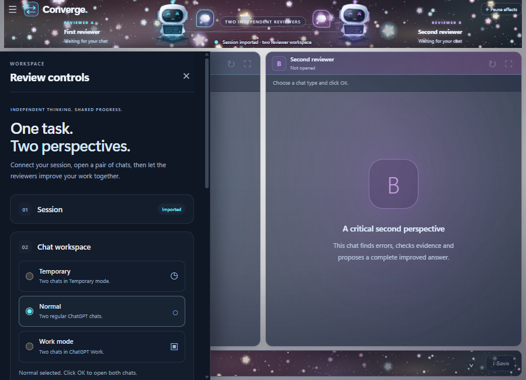

# User guide

[← Project](../README.md) · [Verification](VERIFICATION.md)

## 1. Open Converge

Choose the Windows x64 installer or portable application from the [1.6.5 release](https://github.com/EhosanurRahmanRomi/converge-desktop/releases/tag/v1.6.5).

- **Installer:** follow the setup wizard and open Converge from its shortcut.
- **Portable:** open the portable executable without running an installation wizard.

The release files are unsigned. Recorded verification includes the actual unpacked executable's visible startup, but not a fresh installation or portable-wrapper startup.

The window has its own Minimize, Maximize/Restore and Close controls. Drag the noninteractive header area to move it. Use the top-left menu to show or hide **Review controls**. The drawer hides when a review begins, giving the two chats the full workspace width.

## 2. Import your session

1. In **Session**, click **Import JSON file**.
2. Select a current cookie export for your own ChatGPT account from your PC.
3. Wait for the imported session status. No second import click is required.

Supported JSON shapes are a nonempty cookie array or an object containing a nonempty `cookies` array. The selected file must be `.json` and at most **1 MiB**. You can instead expand **Or paste cookie JSON** and use **Import pasted JSON**.

The file label displays only the filename. Import inputs clear after an attempt. Invalid JSON, empty exports, oversized files and read failures show an error; an invalid replacement does not remove a previously imported session. Cancelling the picker keeps the current state.

The imported session belongs to Converge's in-memory browser profile. It does not clear, modify or sign out Chrome. **Clear session** affects only Converge. Closing Converge loses this imported session, so import again when reopening the app.

**Keep cookie exports private.** They can grant account access. Never include them in screenshots, issue reports, shared folders or this repository. The app does not bypass a sign-in or verification challenge. An expired or rejected session needs a current valid export and any normal provider verification.

## 3. Choose two chats

| Mode | Behavior |
|---|---|
| **Temporary** | Opens two Temporary chats. Unpersonalized mode is not a separate requirement. |
| **Normal** | Opens two regular ChatGPT chats. |
| **Work mode** | Opens two Work chats only when the account exposes that mode and both pages visibly select it. |

Press **Open both chats** after selecting the mode. Both pages must be ready before Start becomes available. Choose the model in **each ChatGPT page**; Converge does not assume the two menus select the same model.

If Temporary state cannot be read, the app may ask you to confirm it on both visible pages. A visibly disabled Temporary mode still blocks starting. Work does not silently fall back to Normal.

The provider controls how chats are retained and which account features are available. Converge's local in-memory session does not mean Normal or Work conversations are deleted from the provider.

## 4. Describe the task

Use **Task brief → Your task** to state what should be solved, created or improved. Include the required output format, constraints and any checks that matter. The task field permits up to **20,000 characters**.

Examples:

> Review this Python function. Fix containment, touching intervals and empty input; do not mutate my inputs. Produce a complete downloadable `.py` file, explain each useful change, and test adversarial cases.

> Correct the attached PDF. Preserve its section order, cover every original question, check the calculations and return the corrected PDF.

Open **Preferences & review rules** to add an optional **Review direction**. Good directions request evidence, edge cases or output inspection. They should not ask the reviewers to invent objections or assert certainty.

### Review approaches

| Approach | Minimum review |
|---|---|
| **Auto** | At least four full improvement rounds for general, creative and file tasks. Recognized simple arithmetic uses two verification steps. |
| **Improve** | At least four full rounds. |
| **Verify** | Two verification steps: a fresh check by each reviewer. |

A full round includes a peer check from **both** reviewers. Both pages first create independent drafts; those drafts are separate from the review rounds. A revision can require another check of the replacement's exact identity before agreement.

The default maximum is **six rounds**. Improvement mode cannot set a maximum below four. The app caps review rounds at **12**, each reply at **30 minutes**, and the entire run at **two hours**. Provider limits can end a task earlier.

## 5. Attach source files

Click **Attach files, images or code** before starting. The app sends the source attachments to both reviewers.

| Limit | Value |
|---|---:|
| Files per selection | Up to **5** |
| One file | Up to **12 MB** |
| Total selected bytes | Up to **24 MB** |

Supported sources include PNG, JPEG, WebP, GIF, PDF, TXT, Markdown, CSV, JSON, DOCX, XLSX and PPTX; readable source code such as Python, JavaScript, TypeScript, C/C++, C#, Java, Go, Rust, MQ5/MQH/MQ4; and readable MT5 `.set` files. The provider's own accepted formats and upload limits also apply.

Readable text is checked for UTF-8 or BOM-marked UTF-16. Code can be uploaded as a readable `.txt` alias, while its original filename and byte identity remain part of the task. This convention does not rename the final saved output.

Standard single-disk ZIP packages are relayed as unchanged opaque bytes after container-header checks. The app does not extract, execute or certify their contents. Multipart and ZIP64 containers are unsupported. Standalone executables, compiled programs and unknown binary formats are unsupported.

Upload errors block Start and show the failure. A request to repair or deliver uploaded code automatically requires a complete corrected downloadable file. A description of a patch does not substitute for that file. **Require a revised file** also turns on for PDF correction work; turn it off when the task only needs analysis or a summary.

### Original source and candidate

- **Original source** is the input you attached at the start of the task.
- **Candidate C1, C2, C3…** is a generated answer or output under review.
- A renamed file with identical verified contents does not count as a file improvement.
- The current candidate's file bytes, ID and SHA-256 accompany peer handoffs.

For large code tasks the app preserves the complete original assignment and uses bounded full source readbacks. It stops if a complete request cannot fit its limits; it does not silently truncate a source into a supposedly complete program. Provider message limits can still reject a request.

## 6. Run and supervise

Press **Start automatic exchange**, or **Ctrl + Enter** in the task panel.

1. Both pages draft independently.
2. A current candidate is sent to the other reviewer with the task, relevant source context and actual supported files.
3. The reviewers check correctness, useful alternatives, evidence and deliverables. Worthwhile replacements become new candidates.
4. A replacement must be checked as the same current candidate by both reviewers.

The lower band shows the current action, round and available output files. Expand it to inspect the **Answer**, **Activity** and **Findings** views. The candidate trail records replacements, reported benefits and whether both reviewers checked that replacement. It retains the first draft for comparison. Cosmetic bot expressions do not represent confidence or measured answer quality.

Use **Stop** at any time. It remains available in the upper header when the controls drawer is hidden.

### How a run ends

| State | Meaning |
|---|---|
| **Agreed** | Both reviewers accept the same candidate, the minimum review is met, unresolved findings are empty and required deliverables are present. |
| **Stopped** | You cancelled the exchange. Inspect and save the useful current candidate. |
| **Limit reached / unfinished** | The task did not meet completion requirements within a limit, or essential work remained unavailable. |
| **Error** | A page, upload, download or request failed. Read the shown reason before restarting. |

The app does not replace required files with prose. If a required file is missing, it makes one bounded creation request for that response before stopping with an explanation. Expired, inaccessible or changed outputs also stop rather than masquerade as successful transfers.

If a task explicitly requires native compilation or an MT5 backtest, removing uncertainty or agreeing that the tool is unavailable does not complete that requirement. Report presence and model-reported evidence are checked, but the app does not independently authenticate a native run or establish profitability.

## 7. Save and continue

Use **Save final files** after agreement, or **Save current files** after an unfinished or stopped run. Choose the destination in the Windows dialog. Save writes captured candidate bytes and preserves the output's actual filename.

Save useful output **before closing or resetting**. The app is not a durable local conversation archive. Closing it loses its exchange state; original attachments and private file bytes are cleared at task completion/Stop/Reset as appropriate. Outputs still visible in the provider's page follow that service's retention rules.

For a follow-up, enter another task and use **Send next command to both**. The same pair of chats keeps its conversation context. A new command clears retained source attachments for the previous task, so attach them again when needed.

To start a fresh pair, use **Reset chats & choose type**. Reset closes both pages, returns to the three mode choices and retains the imported app session.

## 8. Appearance

In **Preferences & review rules → Appearance**:

- Choose **Glowing stars**, **Ghost** or **Flowers**.
- Switch **Animations** On/Off without stopping the reviewers.
- **Pause effects / Resume effects** in the header controls the same setting.

Movement is concentrated in the upper reviewer stage and lower progress band. The center backdrop stays still. Stars and Flowers are capped at 30 frames per second; Ghost at 24. Shared cached sprites bound the rendering work. Decoration suspends while the window is hidden/minimized and respects the system's reduced-motion preference. No new GPU saving over the previous animation engine was measured for 1.6.5.

*Compact interface preview; sample state only.*

## Troubleshooting

| Symptom | Check |
|---|---|
| Start is disabled | Import a valid session, open both pages, wait for readiness, enter a task and resolve upload/mode errors. |
| Work mode is unavailable | Confirm the account offers Work. Choose another mode if it does not. |
| Cookie import fails | Check `.json`, supported shape, size, expiry and normal provider verification. Do not share the export in an issue. |
| A page is still generating or has a draft | Wait for the existing work to finish or clear the draft yourself before starting an exchange. |
| No final file is available | Request the exact downloadable format. Inspect missing-deliverable findings; the app cannot invent a provider download. |
| Output download expires or changes | Preserve the current result, ask for a fresh output and restart the bounded task. |
| A request is too long | Reduce attachments or task size while preserving the requirements. The app reports a size rejection instead of waiting forever. |
| Decoration uses too many resources | Turn Animations Off. Chat work continues. |
| A future ChatGPT layout breaks the bridge | Report the visible failure and safe diagnostics; the browser adapter may need an update. |

For a bug report, include version, chat mode, review approach, steps, expected/observed behavior and **Copy safe page diagnostics** if appropriate. Redact account details and private task content. Never submit cookie exports or authentication tokens.

Two reviewers can still agree on a wrong answer. Independent tests, source checks or appropriate expert review remain necessary for important work.
